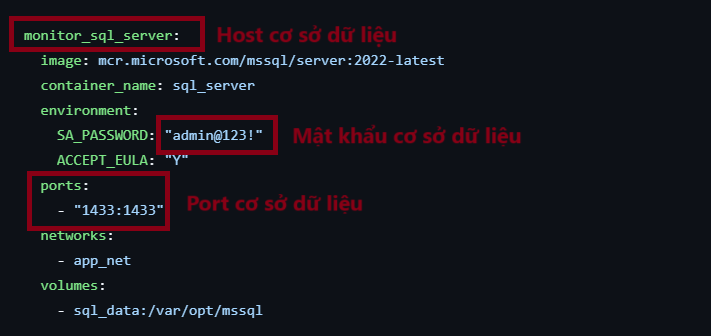
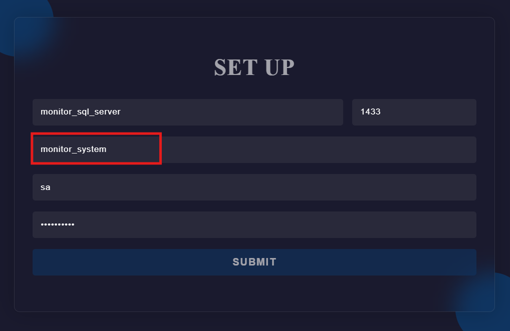
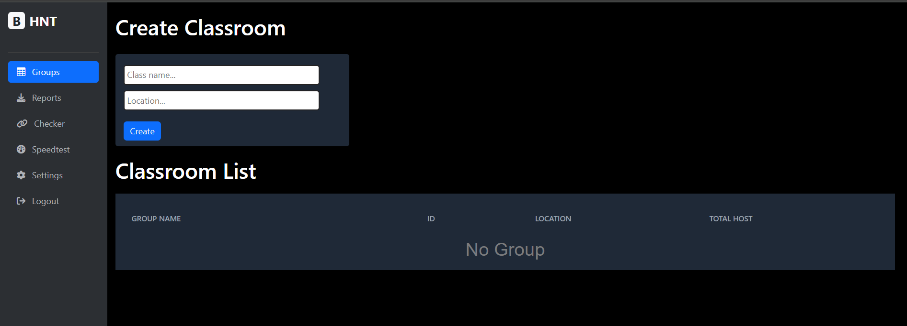

# Monitor System CUSC 2025

Hệ thống giám sát tài nguyên hệ thống máy tính được xây dựng bằng Python Flask, phục vụ nhu cầu theo dõi CPU, RAM, Disk và tốc độ mạng.

---

## 🚀 Cách chạy hệ thống

### Yêu cầu:
- Python 3.x
- Docker (nếu dùng bản container)
- pip (Python package manager)
- Git (nếu clone từ repo)

### Tải hệ thống về
```bash
git clone https://github.com/pwtarbe204/monitor_system_cusc_2025.git
```
### Cấu hình mật khẩu cho Cơ sở dữ liệu
```
cd monitor_system_cusc_2025
cd system
```
Trong thư mục ```system``` có file ```docker-compose.yml```, tại đây hãy đặt mật khẩu cho cơ sở dữ liệu và nhớ nó.


Build image, tạo và chạy các container:
```
docker compose up --build
```
### Hướng dẫn cấu hình

Bước 1: Truy cập ```localhost:9001```


Bước 2: Set up cơ sở dữ liệu



Bước 3: Đăng kí tài khoản


Bước 4: Đăng nhập vào hệ thống


Bước 5:

